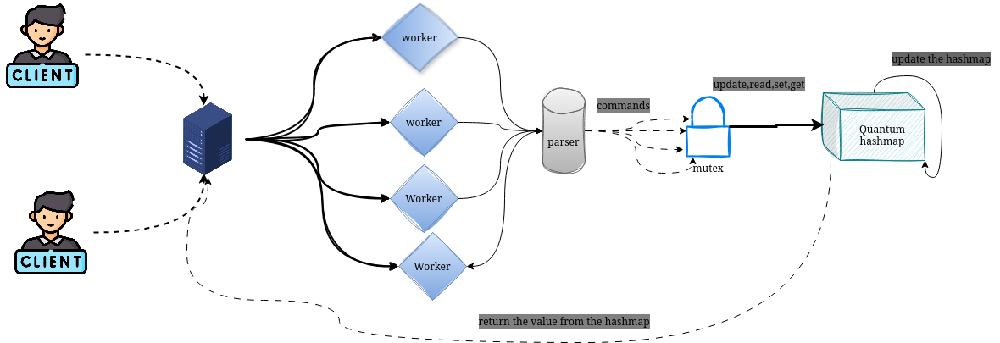
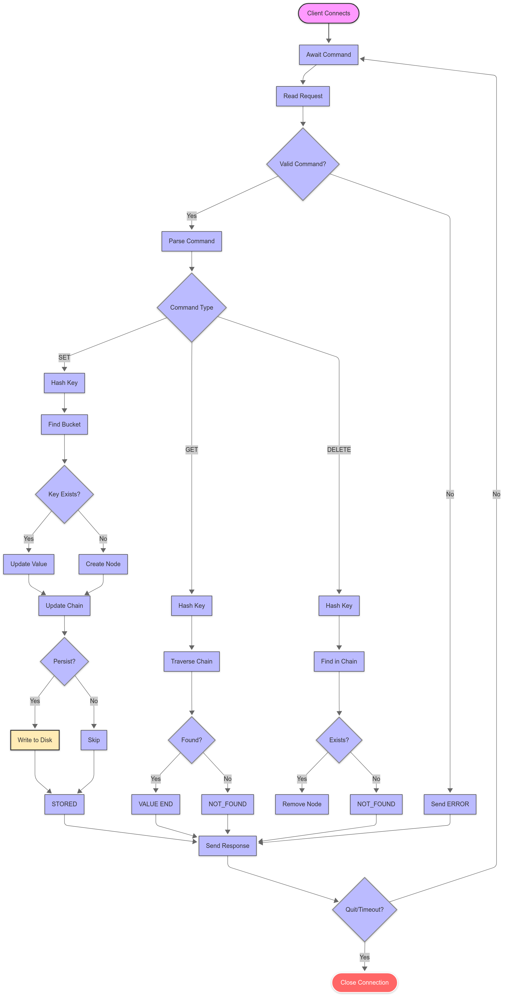
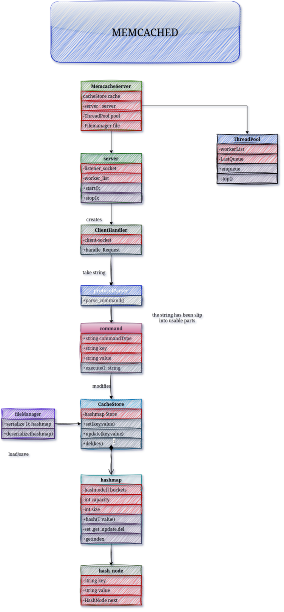

# 🧠 Memcached (C++ Clone)

An in-key memory value store designed to mimic the core functionality of **Memcached**, such as:
- `get`
- `set`
- `update`
- `del`

It includes:
-  Multi-threading support via `std::thread` and `std::async`
- ️ A built-in custom `hashmap`
-  Networking through Telnet (might implement it through Boost.Asio)
-  File input/output persistence
-  Modular design to fulfill OOP principles

# 📊 Diagrams

## 🧱 System Architecture

> 🔹 Note: The **Quantum HashMap** is just the name of my custom-built hashmap

---

## 🧭 Analysis Diagram (Flowchart)

---

## 🔧 UML Class Diagram

> 🔹 Note: Might change a little bit during the implementation phase
# Networking
For networking, the system uses a Telnet-compatible interface to allow clients to connect and issue commands in real time. The server is designed to handle multiple concurrent client connections using std::thread, with each thread responsible for processing incoming requests from a separate client.
The protocol used will be Tcp.Optionally i might use Boost asio to implement it.
# Hashmap
I will implement a custom-built hashmap which will replicate std::unorderedMap<>.
The hashmap will handle collisions using a linked list and will be thread-safe through the use of a mutex. 
One advantage of this is that we can manipulate the hashmap for our use—for example, we can create a read-only memcache with no mutex lock on reads, allowing multiple users to access it at the same time.
# implementation
## ✅ Implementation Checklist

### 🔹 Core Infrastructure
- [ ] Define command interface: `get`, `set`, `update`, `del`, `exit`.
- [ ] Parse client commands with basic tokenization.

### 🔹 Custom Hashmap
- [ ] Implement internal `Node` struct (key, value, next pointer).
- [ ] Implement `HashMap` class with:
    - [ ] Custom hash function.
    - [ ] `insert()` / `set()` method.
    - [ ] `get()` method.
    - [ ] `update()` method.
    - [ ] `delete()` method.
    - [ ] Collision handling using separate chaining.
- [ ] Add `std::mutex` for thread-safe access:
### 🔹 Multithreading Support
- [ ] Accept multiple clients using `std::thread`.
- [ ] Handle each client in a dedicated worker thread.
- [ ] Ensure thread-safe hashmap operations.
- [ ] Implement proper thread cleanup (join/detach).
- 
- ### 🔹 Networking Layer
- [ ] Create socket server using:
    - [ ] Telnet-compatible raw TCP sockets, or
    - [ ] Boost.Asio (optional).
- [ ] Accept client connections in a loop.
- [ ] Process commands sent over TCP.
- [ ] Handle graceful disconnect and client errors.

### 🔹 File
- [ ] Load key value data from a file at startup.
  - [ ] A Logging file for error
- [ ] Write updated data back to file on:
    - [ ] Key updates
    - [ ] Program exit
- [ ] Support simple serialization/deserialization.
